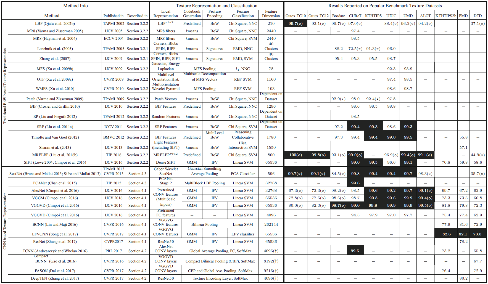

# texture-analysis

 

The repository includes texture representation, recognition, segmentation and others of texture analysis.
Great thank for the pioneer researchers in texture analysis and other related fields! 
Previous work including reviews and other great work for texture analysis.  
authors: wan, sky

Latest review! [From BoW to CNN: Two Decades of Texture Representation for Texture Classification](https://link.springer.com/content/pdf/10.1007%2Fs11263-018-1125-z.pdf)

| [2019](#2019) | [2018](#2018) | [2017](#2017) | [2016](#2016) | [2015](#2015) | [2014](#2014) | [2013](#2013) | [2012](#2012) | [2011](#2011) | [2010-](#2010-) |  
|:--------|:--------:|:--------:|:--------:|:--------|:--------:|:--------:|:--------:|:--------:|:--------:|

This work is in continuous progress and update. Any suggestiones and problems, email me: <wanqian_hust@163.com>   
#### Monthly updated pushed! 

# 2019
| Title | Conf/Journal | Code | Star | Field | Citation | Performance |
|:--------|:--------:|:--------:|:--------:|:--------:|:--------:|:--------:|
| [From BoW to CNN: Two Decades of Texture Representation for Texture Classification](https://link.springer.com/content/pdf/10.1007%2Fs11263-018-1125-z.pdf) | IJCV | [code](*) | * |review | 14 | * |

# 2018
| Title | Conf/Journal | Code | Star | Field | Citation | Performance |
|:--------|:--------:|:--------:|:--------:|:--------:|:--------:|:--------:|
| [Deep Texture Manifold for Ground Terrain Recognition](http://openaccess.thecvf.com/content_cvpr_2018/papers/Xue_Deep_Texture_Manifold_CVPR_2018_paper.pdf) | CVPR | [code](https://github.com/jiaxue1993/Deep-Encoding-Pooling-Network-DEP-) | 27 | recognition | 12 | * |

# 2017
| Title | Conf/Journal | Code | Star | Field | Citation | Performance |
|:--------|:--------:|:--------:|:--------:|:--------:|:--------:|:--------:|
| [Deep TEN: Texture Encoding Network](http://openaccess.thecvf.com/content_cvpr_2017/html/Zhang_Deep_TEN_Texture_CVPR_2017_paper.html) | CVPR | [code](https://github.com/zhanghang1989/Torch-Encoding-Layer) | 68 | recognition | 42 | * |

# 2016
| Title | Conf/Journal | Code | Star | Field | Citation | Performance |
|:--------|:--------:|:--------:|:--------:|:--------:|:--------:|:--------:|
| [Deep Filter Banks for Texture Recognition, Description, and Segmentation](https://link.springer.com/article/10.1007/s11263-015-0872-3) | IJCV | [code](https://github.com/mcimpoi/deep-fbanks) | 71 |rec/seg | 395 | * |
| [Median Robust Extended Local Binary Pattern for Texture Classification](https://ieeexplore.ieee.org/document/7393828) | IEEE TIP | [code](https://github.com/MIPT-Oulu/LocalBinaryPattern) | 0 | recognition | 144 | * |

# 2015
| Title | Conf/Journal | Code | Star | Field | Citation | Performance |
|:--------|:--------:|:--------:|:--------:|:--------:|:--------:|:--------:|
| [Bilinear CNN Models for Fine-grained Visual Recognition](https://link.springer.com/article/10.1007/s11263-015-0872-3) | ICCV | [code](https://github.com/HaoMood/bilinear-cnn) | 196 | recognition | 38 | * |

# 2014
| Title | Conf/Journal | Code | Star | Field | Citation | Performance |
|:--------|:--------:|:--------:|:--------:|:--------:|:--------:|:--------:|

# 2013
| Title | Conf/Journal | Code | Star | Field | Citation | Performance |
|:--------|:--------:|:--------:|:--------:|:--------:|:--------:|:--------:|
| [Invariant Scattering Convolution Networks](https://ieeexplore.ieee.org/document/6522407) | IEEE TPAMI | [code](https://github.com/scatnet/scatnet) | 69 | classification | 727 | * |

# 2012
| Title | Conf/Journal | Code | Star | Field | Citation | Performance |
|:--------|:--------:|:--------:|:--------:|:--------:|:--------:|:--------:|

# 2011
| Title | Conf/Journal | Code | Star | Field | Citation | Performance |
|:--------|:--------:|:--------:|:--------:|:--------:|:--------:|:--------:|

# 2010-
| Title | Conf/Journal | Code | Star | Field | Citation | Performance |
|:--------|:--------:|:--------:|:--------:|:--------:|:--------:|:--------:|
