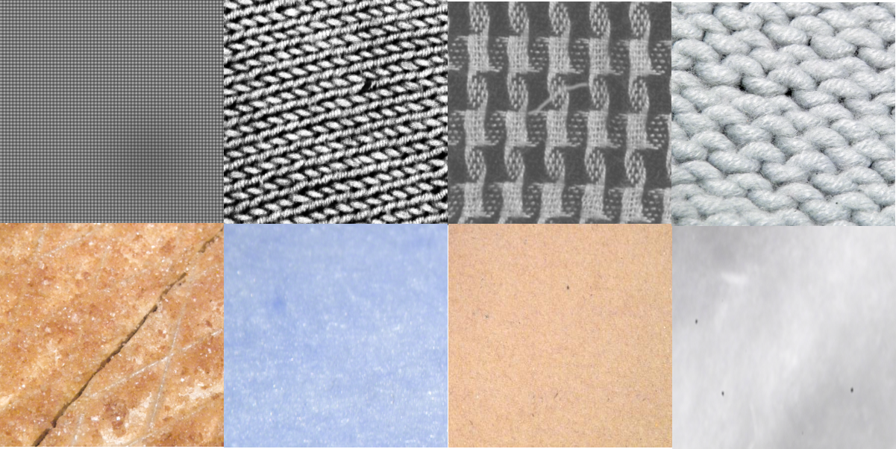

# texture-analysis

 

The repository includes texture representation, recognition, segmentation and others of texture analysis.
Great thank for the pioneer researchers in texture analysis and other related fields! 
Previous work including reviews and other great work for texture analysis. 

 

Authors: wan, sky

Latest review! [From BoW to CNN: Two Decades of Texture Representation for Texture Classification](https://link.springer.com/content/pdf/10.1007%2Fs11263-018-1125-z.pdf)

| [2019](#2019) | [2018](#2018) | [2017](#2017) | [2016](#2016) | [2015](#2015) | [2014](#2014) | [2013-](#2013-) |    
|:--------|:--------:|:--------:|:--------:|:--------|:--------:|:--------:|

This work is in continuous progress and update. Any suggestiones and problems, email me: <wanqian_hust@163.com>   
#### Monthly updated pushed! 

# 2019
Title | Conf/Journal | Code | Star | Field | Citation | Performance 
------|--------------|------|------|-------|----------|-------------
[From BoW to CNN: Two Decades of Texture Representation for Texture Classification](https://link.springer.com/content/pdf/10.1007%2Fs11263-018-1125-z.pdf) | IJCV | [code](*) | * |review | 14 | * 
[Multiscale Feature-Clustering-Based Fully Convolutional Autoencoder for Fast Accurate Visual Inspection of Texture Surface Defects](https://ieeexplore.ieee.org/stamp/stamp.jsp?tp=&arnumber=8598794) | IEEE TASE | [code](*) | * |review | 0 | * 
[Deep Multiple-Attribute-Perceived Network for Real-world Texture Recognition]
(https://pdfs.semanticscholar.org/ba1f/6ef20824aba161c4b3666e29e99486f20390.pdf?_ga=2.164908863.1086869345.1577090910-1870122332.1571051271) | ICCV | [code](*) | * |review | 0 | * 

# 2018
Title | Conf/Journal | Code | Star | Field | Citation | Performance 
------|--------------|------|------|-------|----------|-------------
[Deep Texture Manifold for Ground Terrain Recognition](http://openaccess.thecvf.com/content_cvpr_2018/papers/Xue_Deep_Texture_Manifold_CVPR_2018_paper.pdf) | CVPR | [code](https://github.com/jiaxue1993/Deep-Encoding-Pooling-Network-DEP-) | 27 | recognition | 12 | * 

# 2017
Title | Conf/Journal | Code | Star | Field | Citation | Performance 
------|--------------|------|------|-------|----------|-------------
[Deep TEN: Texture Encoding Network](http://openaccess.thecvf.com/content_cvpr_2017/html/Zhang_Deep_TEN_Texture_CVPR_2017_paper.html) | CVPR | [code](https://github.com/zhanghang1989/Torch-Encoding-Layer) | 68 | recognition | 42 | * 
[Locally transferred fisher vectors for texture classification](http://openaccess.thecvf.com/content_ICCV_2017/papers/Song_Locally-Transferred_Fisher_Vectors_ICCV_2017_paper.pdf) | ICCV | [code](*) | * | recognition | 10 | * 
[FASON: First and Second Order Information Fusion Network for Texture Recognition](https://ieeexplore.ieee.org/document/8100129) | CVPR | [code](*) | * | recognition | 16 | * 

# 2016
Title | Conf/Journal | Code | Star | Field | Citation | Performance 
------|--------------|------|------|-------|----------|-------------
[NetVLAD: CNN architecture for weakly supervised place recognition](https://ieeexplore.ieee.org/stamp/stamp.jsp?tp=&arnumber=7780941&tag=1) | CVPR | [code](https://github.com/Relja/netvlad) | 236 | recognition | 509 | * 
[Compact Bilinear Pooling](https://ieeexplore.ieee.org/document/7780410) | CVPR | [code](https://github.com/gy20073/compact_bilinear_pooling) | 161 | recognition | 181 | * |
[Deep Filter Banks for Texture Recognition, Description, and Segmentation](https://link.springer.com/article/10.1007/s11263-015-0872-3) | IJCV | [code](https://github.com/mcimpoi/deep-fbanks) | 71 |rec/seg | 395 | * 
[Median Robust Extended Local Binary Pattern for Texture Classification](https://ieeexplore.ieee.org/document/7393828) | TIP | [code](https://github.com/MIPT-Oulu/LocalBinaryPattern) | 0 | recognition | 144 | * 
[Using Filter Banks in Convolutional Neural Networks for Texture Classification](https://arxiv.org/pdf/1601.02919.pdf) | PRL | [code](*) | * | recognition | 88 | * |

# 2015
Title | Conf/Journal | Code | Star | Field | Citation | Performance 
------|--------------|------|------|-------|----------|-------------
[PCANet: A Simple Deep Learning Baseline for Image Classification?](https://ieeexplore.ieee.org/document/7234886) | TIP | [code](https://github.com/Ldpe2G/PCANet) | 64 | recognition | 633 | * 
[Bilinear CNN Models for Fine-grained Visual Recognition](https://www.semanticscholar.org/paper/Bilinear-CNN-Models-for-Fine-Grained-Visual-Lin-RoyChowdhury/3a307b7e2e742dd71b6d1ca7fde7454f9ebd2811) | ICCV | [code](https://bitbucket.org/tsungyu/bcnn) | * | recognition | 391 | * 
[Deep filter banks for texture recognition and segmentation](https://www.semanticscholar.org/paper/Deep-filter-banks-for-texture-recognition-and-Cimpoi-Maji/27ce4b367bf52854efa10adab729b484dcf315aa) | CVPR | [code](https://github.com/mcimpoi/deep-fbanks) | 71 | recognition | 325 | * 

# 2014
Title | Conf/Journal | Code | Star | Field | Citation | Performance 
------|--------------|------|------|-------|----------|-------------
[Describing Textures in the Wild](https://www.robots.ox.ac.uk/~vgg/publications/2014/Cimpoi14/) | CVPR | [code](https://github.com/lidong04/deep-fbanks-ct/tree/master/desctex) | 1 | classification | 360 | * 

# 2013-
Title | Conf/Journal | Code | Star | Field | Citation | Performance 
------|--------------|------|------|-------|----------|-------------
[Invariant Scattering Convolution Networks, 2013](https://ieeexplore.ieee.org/document/6522407) | TPAMI | [code](https://github.com/scatnet/scatnet) | 69 | classification | 727 | * 
[Sorted Random Projections for robust texture classification, 2011](https://ieeexplore.ieee.org/document/6126267) | ICCV | [code](*) | * | reconstruction | 84 | * 
[Aggregating local descriptors into a compact image representation, 2010](https://www.semanticscholar.org/paper/Aggregating-local-descriptors-into-a-compact-image-J%C3%A9gou-Douze/0fbb184871bd7660bc579178848d58beb8288b7d) | CVPR | [code](*) | * | recognition | 1319 | * 
[TEXEMS: Texture Exemplars for Defect Detection on Random Textured Surfaces, 2007](https://ieeexplore.ieee.org/abstract/document/4250469/) | TPAMI | [code](*) | * | reconstruction | 108 | * 

